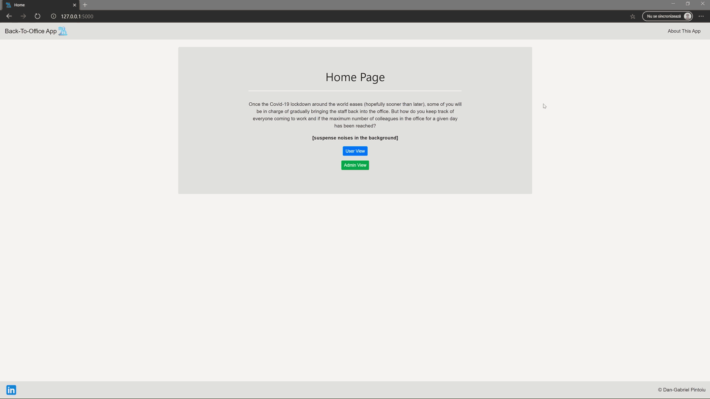

##### The fully functional website is currently hosted on Python Anywhere's platform, and can be found <a href="http://gabrieldan.pythonanywhere.com/">here</a>.
<p>
  
## Why did I built this app? 
  Once the Covid-19 lockdown around the world eases (hopefully sooner than later), some of you will be in charge of gradually bringing the staff back into the office. But how do you keep track of everyone coming to work and if the maximum number of colleagues in the office for a given day has been reached? I believe  there is an easier way to centralize and keep track of every staff member that will come to the office than just counting email requests from colleagues or try to use a shared Excel solution that comes with its own drawbacks. <p>
  By all means, you could try to use shared Excel workbooks saved on shared drives, OneDrive, SharePoint or even use Excel Online as an alternative, but only the ones who've used these solutions know what hassle it is to have a large number of users using the same file at the same time. From users editing the same cell, locked out users while the file is in use, corrupted or missing data, to users hiding or moving columns, formulas, there are a lot of things that can go wrong. <p>
    And that's how the <b>Back-To-Office App</b> came into existence. <p>
  
## How did I built the app and what tools did I use?
* Flask
  * Template inheritance w/ Jinja2
  * Authentication: although I spend a lot of time on Stack Overflow when I encountered blocking points and I found great resources throughout the development phase, I must give credit where credit is due: Anthony Herbert's tutorial on  <a href="https://www.digitalocean.com/community/tutorials/how-to-add-authentication-to-your-app-with-flask-login">implementing authentication to Flask apps</a> was awesome and I can't recommend it highly enough.
  * Values sent from the Back-End to the Front-End passed through ```<render_template>``` as arguments and rendered on pages using Jinja2's engine 
  * Python functions for preventing errors down the line: Initialize a blank database with the declared models if the database is not found when the servers starts, or create default values in the db (eg: if the admin profile is not created already) in order to prevent errors at run time. Verify the input count for the employee name and department to prevent adding large strings in the database (for example ```db.String(50)``` doesn't seem to prevent adding strings with lengths higher than 50 as I would have thought - I have to further investigate on that - this being the reason for using Python to check the strings length before writing in the database)
* HTML, CSS and JavaScript for the Front-End part. JavaScript was mostly used for changing div elements' sizes or even hide them based on particular actions done by the user, and prevent submitting the jQuery ```POST``` request if the date format is not valid
* jQuery AJAX for ```POST``` requests to the database
* The Bootstrap framework for almost all styling properties
* W3.CSS for the employee tables
* (!) An important change that can be done to the app is migrating from SQLite3 to PostgreSQL, if not for the added complexity, security and whatnot, then simply by being easier to integrate with other platforms like Heroku if that's your thing (Heroku doesn't support SQLite3 databases, more details <a href="https://devcenter.heroku.com/articles/sqlite3">here)

### I've built the app with two user profile types in mind:
* <b>End User</b> - the user experience should be as straightforward as it gets:
  * Open the app
  * Submit the presence day(s)
  * Close the app
  * *Optionally*: see all the other presence requests that have been submitted by now and find out how many employees will be in the office at a given date <p>
   <p>
* <b>Admin</b> - after authentication (on top of the options that the end user has), the admin can also:
  * Delete requests (one request at a time or all the requests at once with a press of a button)
  * Modify the maximum number of employees that can be in the office at the same time <p>
   <p>
